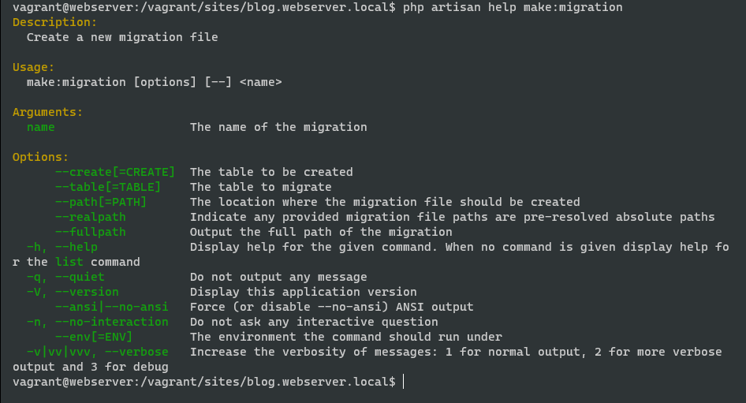

[<Go Back](/README.md)

# Working With Databases

## Environment Files and Database Connections

Todo token o configuración que sea privada, debe ir en .env

Ej: config de base de datos, tokens de aws, información del servidor de correos, etc

Una vez configurada correctamente la config de la base de datos en .env, haciendo de cuenta que la base de datos ya esta creada, usamos el comando `php artisan migrate` para crear las tablas iniciales.

## Migrations: The Absolute Basics

Los archivos de migraciones se encuentran ubicados en `/database/migrations/`.

En el archivo de migraciones de "users", cambiamos la columna "name" a "username" y seguidamente usamos el comando `php artisan migrate:flesh`. Se debe tener cuidado con este comando ya que hace un drop en todas las tablas.

## Eloquent and the Active Record Pattern

Revertimos los cambios en el archivo de migraciones de "users" y hacemos la migración nuevamente.

Cada tabla en la DB tendra un correspondiente modelo en plural, por ejemplo: users -> user

Se puede crear un usuario utilizando `php artisan tinker` y siguiendo los siguientes pasos:

```php
$user = new App\Models\User;

$user->name = 'JeffreyWay';
$user->email ='jeffrey@laracast.com';
$user->password = bcrypt('!password'); //bcrypt se usa para encriptar la contraséña
$user->save(); // Guarda en la DB

$user = new User; // tinker asocia User como un alias del modelo, permitiendonos hacerlo tambien de esta forma
$user->name = 'Sally';
$user->email ='sally@example.com';
$user->password = bcrypt('sally');
$user->save();
```

## Make a Post Model and Migration

Elinamos el modelo o clase 'Post.php' que teniamos, ya que usaremos un modelo eloquent.

Crearemos un modelo nuevo usando `php artisan make:migration`, podemos usar `php artisan help make:migration` para ver información sobre el comando.



Ya que hemos visto la ayuda, sabemos que el comando que ocupamos es
`php artisan make:migration create_posts_table`, ahora si revisamos `/database/migrations/` podemos ver que tenemos creado un nuevo archivo de migraciones.

Ahora en el archivo de migraciones nuevo que se ha creado llamado `/database/migrations/2022_02_14_202409_create_posts_table.php`, podemos ver que tenemos una funcion up() la cual se utiliza para crear la tabla y especificar las columnas a utilizar. Modificaremos esta funcion para que la tabla tenga las columnas que necesitamos y usaremos `php artisan migrate`:

```php
    public function up()
    {
        Schema::create('posts', function (Blueprint $table) {
            $table->id();
            $table->string('title');
            $table->text('excerpt');
            $table->text('body');
            $table->timestamps();
            $table->timestamp('published_at')->nullable();
        });
    }
```

Ahora crearemos un modelo 'Post' usando el comando `php artisan make:model Post` lo cual crea `/app/Models/Post.php`.

Agregaremos 2 posts a la DB utilizando `php artisan tinker`:

```php
$post = new App\Models\Post;
$post->title = 'My first Post';
$post->excerpt ='Reprehenderit amet non dolore culpa reprehenderit consectetur velit veniam occaecat deserunt do elit culpa. Sunt culpa minim veniam dolor dolor Lorem culpa consequat exercitation amet ea. Amet non veniam dolor officia excepteur eiusmod ipsum aliqua labore nulla eiusmod aliquip excepteur enim. Pariatur excepteur deserunt velit deserunt ullamco dolore minim laboris velit aliquip veniam ut. Dolor dolore quis et nulla anim commodo. Esse elit cillum ex nisi officia duis ad duis velit amet esse sunt mollit occaecat.';
$post->body = 'Nostrud nostrud laborum sunt ut commodo aliqua nostrud incididunt non labore consequat in reprehenderit nulla. Ex minim mollit eiusmod dolore incididunt excepteur Lorem laboris ipsum dolor magna deserunt irure. Sint pariatur deserunt enim irure ex culpa proident sit laborum sit sunt consequat ex nostrud. Exercitation exercitation velit occaecat consequat pariatur id dolor exercitation ad cillum. Sint consectetur enim irure adipisicing incididunt et cillum ea laborum irure. Exercitation occaecat culpa irure anim ullamco elit enim.

Elit dolore reprehenderit sunt aliqua. Eu aliqua pariatur magna ullamco dolore consequat. Adipisicing adipisicing cillum aliqua laborum ea esse in anim ad cupidatat sint sunt.';
$post->save();
```

Ya con el post agregado, el siguiente paso seria cambiar en las vistas y en las rutas para que utilicemos `$id` y no `$slug`, ya que ahora lo que recibiremos son IDs.

## Eloquent Updates and HTML Escaping

Ahora modicaremos los 2 posts para cambiar el 'body' y agregarle las etiquetas html <p>, esto lo haremos desde `php artisan tinker`:

```php
$post = App\Models\Post::first();
$post -> body = '<p>'. $post->body .'</p>';
$post -> save();

$post = App\Models\Post::find(2); //Buscamos el post con ID 2, en este caso el segundo post
$post -> body = '<p>'. $post->body .'</p>';
$post -> save();
```

Se puede guardar etiquetas html sin embargo hay que tener cuidado, ya que si la idea es que en las vistas se lean los datos que se estan pasado como html, es posible insertar scripts maliciosos.

```php
$post = App\Models\Post::first();
$post->title = 'My <strong>first</strong> Post';
$post -> save();
```

y modificamos la vista para que utilice `{!! $post->title !!}`

## 3 Ways to Mitigate Mass Assignment Vulnerabilities

Agregamos un tercer post de la misma manera que lo hicimos anteriormente y luego agregaremos un cuarto post de la siguiente manera, igual desde `php artisan tinker`:

```php
$post = new App\Models\Post::create(['title'=>'My fourth Post', 'excerpt' => 'excerpt of post', 'body' => 'Deserunt exercitation occaecat quis non. Ut officia enim ex irure. Lorem exercitation incididunt ipsum reprehenderit irure laborum eu nulla. Nostrud excepteur id fugiat voluptate elit dolor ea ut. Officia in aliquip ad sunt. Sit consectetur occaecat aliqua duis proident voluptate pariatur tempor labore minim dolore. Anim enim nulla ipsum fugiat dolore.

Fugiat dolor anim excepteur sint nulla laboris. Minim sit minim labore dolor dolor nostrud consequat velit est exercitation laborum dolor reprehenderit et. Cupidatat nostrud ipsum pariatur mollit amet qui in. Sint mollit et qui sit amet. Ut ut officia adipisicing aute ex dolor et pariatur. Adipisicing ex quis minim incididunt voluptate dolore duis commodo sit proident aliqua aliqua ipsum. Pariatur Lorem occaecat cupidatat aliqua laborum cupidatat Lorem eiusmod deserunt culpa.']);
```

Sin embargo, para que sirva de esta forma, tendremos que arreglar una serie de errores, ya que no se permite asignar masivamente los campos title, excerpt y body. Esto no se permite por motivos de seguridad, ya que puede prestarse para que algun usuario malicioso ingrese datos malevolos. Esto se conoce como: Mass asignement vulnerability.

Hay 3 formas en que se puede resolver esto, modificando `/app/Models/Post.php`:

1. Usando la variable $fillable, la cual permite agregar masivamente los campos especificados.

```php
class Post extends Model
{
    use HasFactory;

    protected $fillable = ['title', 'excerpt', 'body'];
}
```

2. Usando la variable $guarded, la cual permite agregar masivamente todos los campos excepto los que se especifican

```php
class Post extends Model
{
    use HasFactory;

    protected $guarded = ['id'];
}
```

3. Usando la variable $guarded con un array vacio y no agregar filas a la tabla por medio de asignamientos masivos.

```php
class Post extends Model
{
    use HasFactory;

    protected $guarded = [];
}
```

## Route Model Binding

Gracias a route model binding, podemos cambiar la routa de la siguiente manera para que utiliza la variable $post. Esto sucede gracias a que el wildcard que en este caso es {post}, esta ligado con el modelo Post.php

```php
Route::get('/posts/{post}', function (Post $post) {
    return view('post', [
        'post' => $post
    ]);
});
```

Hay caso en los que ocuparemos buscar utilizando otros campos y no por post, por lo tanto modificaremos la funcion up() en `/database/migrations/2022_02_14_202409_create_posts_table.php` y usaremos un `php artisan migrate:fresh` para recrearla las tablas

```php
    public function up()
    {
        Schema::create('posts', function (Blueprint $table) {
            $table->id();
            $table->string('slug')->unique();
            $table->string('title');
            $table->text('excerpt');
            $table->text('body');
            $table->timestamps();
            $table->timestamp('published_at')->nullable();
        });
    }
```

Ahora volvemos a agregar los cuatros post pero esta vez con el slug y modificamos el archivo de rutas

```php
Route::get('/posts/{post:slug}', function (Post $post) { //Post::where('slug', $post)-> firstOrFail();
    return view('post', [
        'post' => $post
    ]);
});
```

y luego modificamos la vista `posts.blade.php` para que utilice `slug` y no `id`.

```php
<a href="/posts/{{ $post->slug }}">
    {{ $post->title }}
</a>
```

Otra forma de hacer esto, en caso de que el slug siempre vaya a ser el identificador,es modificando `/app/Models/Post.php`:

```php
class Post extends Model
{
    use HasFactory;

    protected $guarded = [];

    public function getRouteKeyName()
    {
        return 'slug';
    }
}
```

y en la ruta

```php
Route::get('/posts/{post}', function (Post $post) { //Post::where('slug', $post)-> firstOrFail();
    return view('post', [
        'post' => $post
    ]);
});
```

## Your First Eloquent Relationship

Crearemos el modelo y migration para 'Category' usando el comando `php artisan make:model Category -m`

Una vez creada la migracion y modelo, modificamos los archivos

`/database/migrations/2022_02_14_224748_create_categories_table.php`

```php
    public function up()
    {
        Schema::create('categories', function (Blueprint $table) {
            $table->id();
            $table->string('name');
            $table->string('slug');
            $table->timestamps();
        });
    }
```

`/database/migrations/2022_02_14_202409_create_posts_table` donde le agregaremos una columna para la llave foranea

```php
    public function up()
    {
        Schema::create('posts', function (Blueprint $table) {
            $table->id();
            $table->foreignId('category_id');
            $table->string('slug')->unique();
            $table->string('title');
            $table->text('excerpt');
            $table->text('body');
            $table->timestamps();
            $table->timestamp('published_at')->nullable();
        });
    }
```

Usamos `php artisan migrate:fresh` y agregamos 3 categorias de la siguiente forma(Personal, Work, Hobbies):

```php
use App\Models\Category;
$c = new Category;
$c->name = 'Personal';
$c->slug = 'personal';
$c->save();
```

Ahora crearemos unos posts con categorias usando `php artisan tinker`

```php
use App\Models\Post;
Post::create([
    'title' => 'My Family Post',
    'excerpt' => 'Excerpt for my post',
    'body' => 'Lorem ipsum dolar sit amet.',
    'slug' => 'my-family-post',
    'category_id' => 1
]);
Post::create([
    'title' => 'My Work Post',
    'excerpt' => 'Excerpt for my post',
    'body' => 'Lorem ipsum dolar sit amet.',
    'slug' => 'my-work-post',
    'category_id' => 2
]);
Post::create([
    'title' => 'My Hobbies Post',
    'excerpt' => 'Excerpt for my post',
    'body' => 'Lorem ipsum dolar sit amet.',
    'slug' => 'my-hobbies-post',
    'category_id' => 3
]);
```

Ahora que ya tenemos los post con categorias asignadas, modificaremos `/app/Models/Post.php` para agregar la relación con las categorias.

```php
class Post extends Model
{
    use HasFactory;

    protected $guarded = [];

    public function category()
    {
        return $this->belongsTo(Category::class); // De esta forma decimos que un post pertenece a una categoria
    }
}
```

Para terminar, le agregamos a las vistas lo siguiente, para que muestre a que categoria pertenece cada post.

```php
<p>
    <a href="#">{{ $post->category->name }}</a>
</p>
```

## Show All Posts Associated With a Category

Modificamos `/app/Models/Category.php` para agregar la relacion con posts, ya que una categoria puede tener muchos posts.

```php
class Category extends Model
{
    use HasFactory;

    public function posts()
    {
        return $this->hasMany(Post::class);
    }
}
```

Luego agregamos una ruta nueva que se encargara de mostrar las categorias

```php
Route::get('/categories/{category:slug}', function (Category $category) {
    return view('posts', [
        'posts' => $category->posts
    ]);
});
```

y modificamos en las vistas el url para que utilice la ruta nueva que creamos

```php
<p>
    <a href="/categories/{{$post->category->slug}}">{{ $post->category->name }}</a>
</p>
```

## Clockwork, and the N+1 Problem

Usaremos [Clockwork](https://underground.works/clockwork/) en nuestro explorador para poder hacer debugging.

Primero instalaremos usando `composer require itsgoingd/clockwork` y luego la extensión del navegador.

Ahora que tenemos instalado Clockwork, podemos recargar la pagina y en los Developer Tools podremos encontrar una nueva pestañá llamada Clockwork.


Si revisamos en la pestaña de database que aparece en Clockwork, podremos ver que tenemos un /get que se realizado al cargar la pagina el cual genero 4 sql queries mientras que solo tenemos 3 posts, a esto se le llama 'N+1 Problem'.


Este problema lo podemos resolver modificando la ruta

```php
Route::get('/', function () {
    return view('posts', [
        'posts' => Post::with('category')->get()
    ]);
});
```

`Post::with('category')->get()` lo que hace es solicitar los post junto con la categoria a la que pertenece cada uno y con el `->get()` realiza el query. Una vez esto resuelto, podemos observer que ya solo realiza 2 sql queries.


## Database Seeding Saves Time

Le agregaremos el author a cada post, por lo cual ocuparemos modificar `/database/migrations/2022_02_14_202409_create_posts_table` donde le agregaremos una columna para la llave foranea a la tabla de usuarios y luego usaremos `php artisan migrate:fresh`

```php
    public function up()
    {
        Schema::create('posts', function (Blueprint $table) {
            $table->id();
            $table->foreignId('user_id');
            $table->foreignId('category_id');
            $table->string('slug')->unique();
            $table->string('title');
            $table->text('excerpt');
            $table->text('body');
            $table->timestamps();
            $table->timestamp('published_at')->nullable();
        });
    }
```

Sin embargo, nuevamente nos quedamos sin datos en la DB y debemos agregar para poder hacer pruebas.

Primero, modificaremos `/database/migrations/2022_02_14_224748_create_categories_table` para que su name y slug sean unique();

```php
public function up()
{
    Schema::create('categories', function (Blueprint $table)
    {
        $table->id();
        $table->string('name')->unique();
        $table->string('slug')->unique();
        $table->timestamps();
    });
}
```

Despues modificaremos `/app/Models/User.php` para agregar la relacion con posts, ya que un usuario puede tener muchos.

```php
public function posts()
{
    return $this->hasMany(Post::class);
}
```

Tambien modificaremos `/app/Models/Post.php` para agregar la relacion con usuarios, ya que un post le pertenece a un usuario quien lo publica.

```php
public function user()
{
    return $this->belongsTo(User::class);
 }
```

Y modificaremos `/resources/views/post.blade.php` para que muestre el nombre del usuario o author del post.

```php
 <p>
    By <a href="#">{{ $post->user->name }}</a> in <a
        href="/categories/{{ $post->category->slug }}">{{ $post->category->name }}</a>
</p>
```

Terminando, para solucionar el problema de tener que estar añadiendo datos a las tablas manualmente cada vez que hacemos una migración, modificaremos el archivo `/database/seeders/DatabaseSeeder.php` para que contenga datos de prueba.

```php
    public function run()
    {
        //Hacemos un truncate al inicio del seed para que cuando llamemos el comando 'php artisan db:seed', no debe problemas por ya haber datos existentes
        User::truncate();
        Category::truncate();
        Post::truncate();

        $user = User::factory()->create();

        $personal = Category::create([
            'name' => 'Personal',
            'slug' => 'personal',
        ]);

        $family = Category::create([
            'name' => 'Family',
            'slug' => 'family',
        ]);

        $work = Category::create([
            'name' => 'Work',
            'slug' => 'work',
        ]);

        Post::create([
            'user_id' => $user->id,
            'category_id' => $family->id,
            'title' => 'My Family Post',
            'slug' => 'my-first-post',
            'excerpt' => 'Excerpt for my post',
            'body' => '<p>Sit dolore est minim non nostrud aliquip. Id aliquip eiusmod nulla excepteur laboris dolore elit culpa ipsum sunt ea Lorem cillum do. Sint magna veniam minim laboris. Sint laboris dolor do nisi excepteur enim minim et consectetur ex anim elit ut veniam.

Non officia anim deserunt irure exercitation est enim anim officia. Ut aliqua enim nostrud nisi nisi quis velit elit do id in est fugiat. Ex voluptate proident ex cupidatat ad nulla nisi laboris elit ut. Elit sunt irure deserunt cillum sint. Eiusmod occaecat deserunt Lorem aliquip aute officia sint voluptate. Proident sint anim id occaecat anim ea fugiat.</p>',
        ]);

        Post::create([
            'user_id' => $user->id,
            'category_id' => $work->id,
            'title' => 'My Work Post',
            'slug' => 'my-second-post',
            'excerpt' => 'Excerpt for my post',
            'body' => '<p>Sit dolore est minim non nostrud aliquip. Id aliquip eiusmod nulla excepteur laboris dolore elit culpa ipsum sunt ea Lorem cillum do. Sint magna veniam minim laboris. Sint laboris dolor do nisi excepteur enim minim et consectetur ex anim elit ut veniam.

Non officia anim deserunt irure exercitation est enim anim officia. Ut aliqua enim nostrud nisi nisi quis velit elit do id in est fugiat. Ex voluptate proident ex cupidatat ad nulla nisi laboris elit ut. Elit sunt irure deserunt cillum sint. Eiusmod occaecat deserunt Lorem aliquip aute officia sint voluptate. Proident sint anim id occaecat anim ea fugiat.</p>',
        ]);
    }
```

Este archivo se encargara de crear un usuario con datos aleatorios, crear 3 categorias y luego crear 2 posts, esto se puede hacer con el comando `php artisan db:seed` el cual agregara los datos sin modificar las propiedas de las tablas o con el comando `php artisan migrate:fresh --seed`, el cual elimina todas las tablas y vuelva a realizar las migraciones y ya que tiene `--seed`, tambien agrega los datos de prueba.

## Turbo Boost With Factories

En caso de ocupar un model para comentarios por ejemplo, podriamos crearlo con `php artisan make:model Comments -mf` de esta forma creariamos el modelo,migration y factory de Comments.

En este caso, crearemos un factory para Post y uno para Category usando `php artisan make:factory PostFactory` y `php artisan make:factory CategoryFactory`los cuales aparecera en `/database/factories/` y luego los modificaremos.

```php
class PostFactory extends Factory
{
    /**
     * Define the model's default state.
     *
     * @return array
     */
    public function definition()
    {
        return [
            'user_id' => User::factory(),
            'category_id' => Category::factory(),
            'slug' => $this->faker->slug(),
            'title' => $this->faker->sentence(),
            'excerpt' => $this->faker->sentence(),
            'body' => $this->faker->paragraph(),
        ];
    }
}
```

```php
class CategoryFactory extends Factory
{
    /**
     * Define the model's default state.
     *
     * @return array
     */
    public function definition()
    {
        return [
            'name' => $this->faker->word(),
            'slug' => $this->faker->slug(),
        ];
    }
}
```

Para terminar, modificaremos `/database/seeders/DatabaseSeeder.php` y usaremos el factory que acabamos de crear de Post, donde el factory de Post utiliza los de Category y User para generar parte de sus datos.

```php
class DatabaseSeeder extends Seeder
{
    /**
     * Seed the application's database.
     *
     * @return void
     */
    public function run()
    {
        Post::factory(5)->create();
    }
}
```

Esta funcion nos genera 5 post, cada uno con 1 categoria y 1 usuario distinto, para un total de 5 post, 5 categorias y 5 usuarios. Los factory son muy utiles para llenar rapidamente la DB de datos de prueba.

## View All Posts By An Author

Cambio en el archivo de rutas para que al mostrar todos los post, los muestre por orden del mas nuevo al mas viejo y traiga tambien los datos del author

```php
Route::get('/', function () {
    return view('posts', [
        'posts' => Post::latest()->with('category, author')->get()
    ]);
});
```
